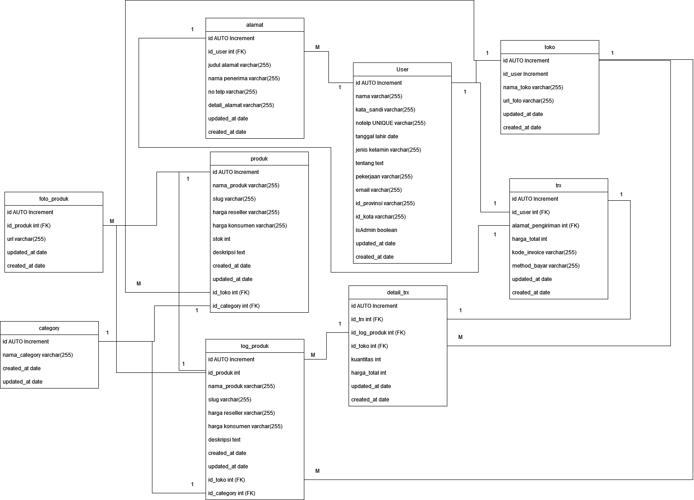

# E-commerce API Project

This project is the final assignment for the **Project-Based Virtual Intern - Backend Developer Evermos x Rakamin Academy**. The goal of the assignment is to develop a robust e-commerce API using **Golang**, the **Fiber framework**, and **MySQL database** while adhering to specific requirements and implementing best practices.

## Features and Requirements

1.  **Comprehensive Routing**  
    The API includes all required routes as specified in the [Postman collection](https://github.com/Fajar-Islami/go-example-cruid/blob/master/Rakamin%20Evermos%20Virtual%20Internship.postman_collection.json). Additional routes can be implemented, but none of the original routes may be removed.
    
2.  **Unique Constraints**  
    User **email** and **phone number** must be unique across the application.
    
3.  **Authentication & Authorization**
    
    -   JWT is used for secure user authentication.
    -   Users cannot access or manage other users' data, including addresses, store details, products, and transactions.
4.  **File Upload**  
    The API supports file uploads for features such as product images.
    
5.  **Automated Store Creation**  
    A store is automatically created when a user registers.
    
6.  **Address Management**  
    Address data is mandatory for product shipment purposes.
    
7.  **Admin-Only Features**  
    Only admin users can manage product categories.
    
8.  **Data Pagination and Filtering**  
    The API implements pagination and supports data filtering as demonstrated in the provided Postman collection.
    
9.  **Product Transaction Logging**
    
    -   A **Product Log Table** records details of products involved in each transaction.
    -   This ensures traceability and transactional accuracy.
10.  **Clean Architecture**  
    The project follows clean architecture principles to maintain scalability, testability, and maintainability.
    

## Resources

To assist in the development of this API, the following resources are provided:

1.  **Indonesian Regions Data**  
    Retrieve regional data for Indonesia using the API available at:  
    [https://www.emsifa.com/api-wilayah-indonesia/](https://www.emsifa.com/api-wilayah-indonesia/)
    
2.  **Database Design**  
    The database schema for this project can be viewed at the following link:  
    
