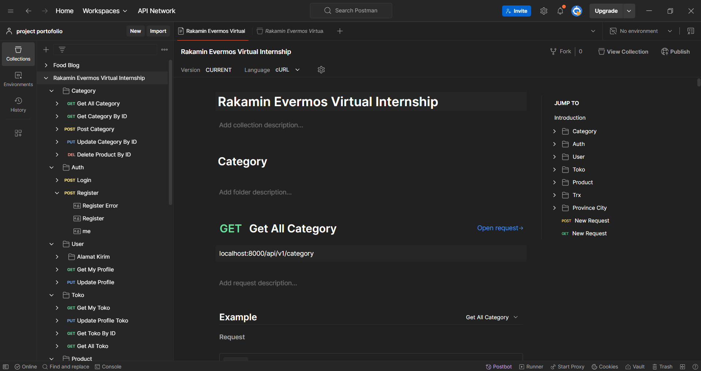
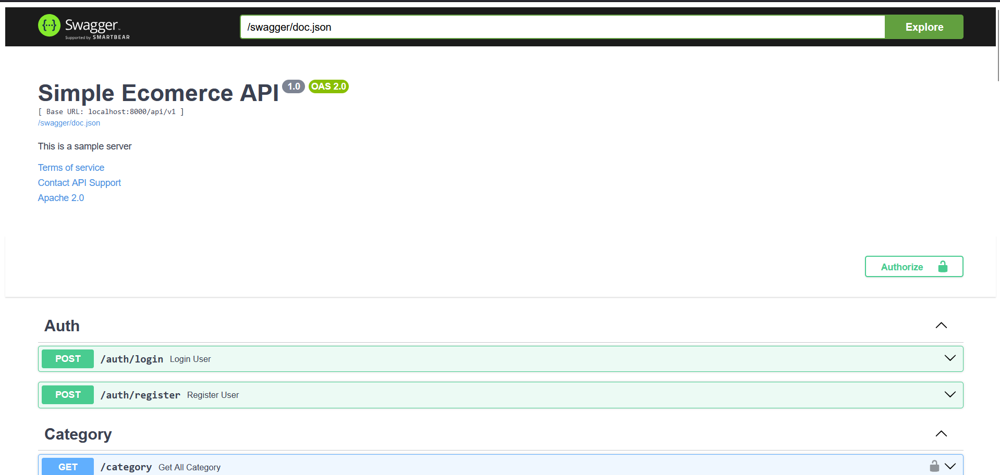

  

  

# E-commerce API Project

  

-blue?style=for-the-badge)

  

  

This project is the final assignment for the **Project-Based Virtual Intern - Backend Developer Evermos x Rakamin Academy**. The goal of the assignment is to develop a robust e-commerce API using **Golang**, the **Fiber framework**, and **MySQL database** while adhering to specific requirements and implementing best practices.

  

  

## Features and Requirements

  

  

1.  **Comprehensive Routing**

  

The API includes all required routes as specified in the [Postman collection](https://github.com/Fajar-Islami/go-example-cruid/blob/master/Rakamin%20Evermos%20Virtual%20Internship.postman_collection.json). Additional routes can be implemented, but none of the original routes may be removed.

  

2.  **Unique Constraints**

  

User **email** and **phone number** must be unique across the application.

  

3.  **Authentication & Authorization**

  

- JWT is used for secure user authentication.

  

- Users cannot access or manage other users' data, including addresses, store details, products, and transactions.

  

4.  **File Upload**

  

The API supports file uploads for features such as product images.

  

5.  **Automated Store Creation**

  

A store is automatically created when a user registers.

  

6.  **Address Management**

  

Address data is mandatory for product shipment purposes.

  

7.  **Admin-Only Features**

  

Only admin users can manage product categories.

  

8.  **Data Pagination and Filtering**

  

The API implements pagination and supports data filtering as demonstrated in the provided Postman collection.

  

9.  **Product Transaction Logging**

  

- A **Product Log Table** records details of products involved in each transaction.

  

- This ensures traceability and transactional accuracy.

  

10.  **Clean Architecture**

  

The project follows clean architecture principles to maintain scalability, testability, and maintainability.

  

  

## Resources

  

  

To assist in the development of this API, the following resources are provided:

  

  

1.  **Indonesian Regions Data**

  

Retrieve regional data for Indonesia using the API available at:

  

[https://www.emsifa.com/api-wilayah-indonesia/](https://www.emsifa.com/api-wilayah-indonesia/)

  

2.  **Database Design**

  

The database schema for this project can be viewed at the following link:

  

[https://www.emsifa.com/api-wilayah-indonesia/](https://www.emsifa.com/api-wilayah-indonesia/)

  

## Tech Stack

  

  

This project is built using the following technologies:

  

  

### Backend

  

-  **Language**: Golang

  

-  **Framework**: [Fiber](https://gofiber.io/) - A fast and lightweight web framework inspired by Express.js

  

-  **Database**: MySQL - A relational database management system

  

-  **Authentication**: JWT (JSON Web Tokens) for secure user authentication

  

-  **ORM**: GORM - An Object Relational Mapper for Golang

  

-  **Swagger**: For API testing and documentation

  

  

### Tools

  

-  **Postman**: For API testing and documentation

  

-  **Git**: Version control system

  

-  **Docker** : For containerization and development environment setup

  

-  **VS Code**: Preferred code editor

  

  

### Deployment

  

-  **Platform**: (Specify platform if used, e.g., AWS, Heroku, or local server)

  

  

## Running the Project

  

  

To run this project locally, follow these steps:

  

  

### Prerequisites

  

Before starting, ensure you have the following installed:

  

-  **Go** (Golang) - The language used for the project. [Installation Guide](https://golang.org/doc/install)

  

-  **MySQL** - The database used by the application. [Installation Guide](https://dev.mysql.com/doc/refman/8.0/en/installing.html)

  

-  **Postman** (optional) - For API testing and exploring the endpoints.

  

  

### Setup Steps

  

  

1.  **Clone the repository**

  

First, clone the project to your local machine:

  

  

```bash
git  clone  https://github.com/arief2020/simple-ecomerce
cd  simple-ecomerce
```
2. **Rename .env.example to .env.development and fill the configuration**
	  ```
	  Copy .env.example and rename to .env.development.
	  ```


3. **Fill the .env.development for app configuration**

  

```bash
debug=true  # enable debugging true|false
host=""
httpport=  # default port being used if not specified on cli
appName=""
version=""
secretJwt=""

mysql_dbname=""
mysql_username=""
mysql_password=""
mysql_root_password=""
mysql_host=""
mysql_port=
mysql_schema=""
mysql_logMode=true
mysql_maxLifetime=30
mysql_maxOpenConnections=30
mysql_minIdleConnections=10

```
  

### Running in Docker

  

If you prefer to run the project inside a Docker container, follow these steps:

  

1. Copy .env.example and rename to .env.development.

```bash

cp .env.example .env.development

```

  

3. Fill the .env.development for app configuration

  

```bash
debug=true  # enable debugging true|false
host=""
httpport=  # default port being used if not specified on cli
appName=""
version=""
secretJwt=""

mysql_dbname=""
mysql_username=""
mysql_password=""
mysql_root_password=""
mysql_host=""
mysql_port=
mysql_schema=""
mysql_logMode=true
mysql_maxLifetime=30
mysql_maxOpenConnections=30
mysql_minIdleConnections=10

```
4.  **Install Go dependencies**

  

Navigate to the project directory and install all Go dependencies:
```
go mod tidy
```
  

5. **Build and Run the Docker container:**

  

```bash

docker compose --env-file .env.development up --build -d

```
6. **Run the mysql database and make database for app**
You can use platform like [xampp](https://www.apachefriends.org/) or [laragon](https://laragon.org/) to running the mysql database
7. **Make migration and run the app**
```
go run app/main.go
```

# How to Test the App

  

You can test the API using the following tools:

  

### 1. Using Postman

Postman is a popular tool for API testing. Follow these steps to test the API using Postman:

  

1. Download the Postman collection from the link below:

[Postman Collection](https://github.com/arief2020/simple-ecomerce/blob/main/docs/postman_collection.json)

2. Import the collection into Postman.

3. Start testing the endpoints provided in the collection.

  



  

### 2. Using Swagger

Swagger provides an interactive API documentation and testing interface.

  

1. Access the Swagger UI by navigating to the following URL in your browser:

[Swagger Documentation](http://localhost:8000/swagger/index.html)

2. Explore the available endpoints and their details.

3. Use the built-in testing interface to send requests and view responses directly.

  



  

> **Note:** Ensure that the application is running locally or on a server before testing the APIs using either Postman or Swagger.
